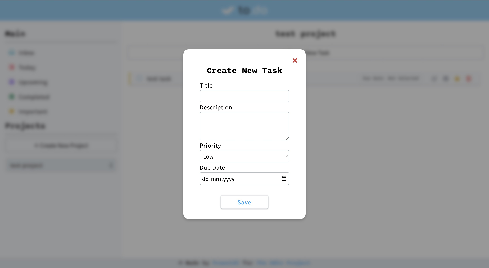

# To-Do List

<h3 align="center"><a href="https://praesidi.github.io/todo-list/">DEMO</a></h2>

## About the project

Another project I made as a part of The Odin Project curriculum and the most challenging so far. The main goal was to use all acquired knowledge to build a functional todo list. The project is mobile responsive :)

## Features

- Add/Delete/Edit tasks
- Add/Delete/Edit projects
- View info about a task
- Mark tasks as finished
- Mark tasks as important
- Mobile responsive
- Saves all tasks and project to local storage
- Viewing tasks by a specific category (all, today, upcoming, completed, important, by project)

## Resources

- Icons: [fontawesome.com](fontawesome.com)
- Favicon&Logo: [flaticon.com](flaticon.com)

## Built with

- HTML
- Sass
- JS
- Webpack
- date-fns library
- nanoid library
